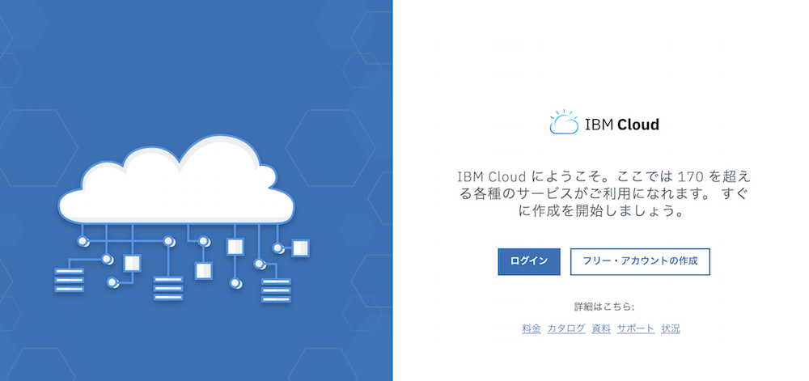

# Academic-Initiative

# IBM Academic Initativeの登録とIBM Cloudライト・アカウントへの適用

（2019年2月現在）  
大学の先生方、研究員、学生の皆様は、[IBM Academic Initiative](URL "https://developer.ibm.com/academic/") の豊富なリソース、教材を使うことが出来ます。  
このページは、Academic Initiativeのリソースの一つである、IBM Cloudへのプロモーション・コードの適用について説明します。  
プロモコードの適用で、  
* IBM Cloudの使用期限の延長（先生１年まで、学生半年まで。期限切れる前に更新可能。）  
* APIやサービスを標準プランで使用すること（通常、標準プランを使うにはクレジットカード登録が必要。）  

などが可能になります。（2019年2月現在の情報です。）

## 1. IBM IDの取得  
http://ibm.biz/create_ibm_id からIBM IDを登録します。 こちらは飛ばして、次章からでも登録可能です。 
  
  

## 2. IBM Cloudライト・アカウントの登録  
https://console.bluemix.net/
から「フリー・アカウントの作成」をクリックします。IBM IDがとれていると、紐付けますと表示が出るのでそのまま登録します。

  
## 3. IBM Academic Initativeの登録

[OnTheHUBのIBM Academic Initiativeページ](URL "www.onthehub.com/ibm/")で、
左側、下の方「Cloud」欄の「Cloud Access」をクリック。 

  
  
右上の「登録」をクリックし、大学発行のメールアドレスと入力して「続行」。 

必要事項を入力して「登録」。  
届いたメールに記載されているリンクをクリックして認証します。  
  
  
  
## 4. IBM Cloudプロモコードの取得  
前章のメールのリンク先から、サインインします。  
先生・研究者の方は「Faculty/Staff」タブを選択、学生さんは「Students」タブを選択。
「IBM Cloud Promo Code」をクリック。  

  
「カートに追加」をクリックします。 
ページ右上のカートアイコンをクリックし、カートの中身を確認して「ご注文手続き」をクリックします。  
同意事項を確認し、「同意します」をクリックします。  
アンケートに回答して「続行」。  
オーダーの最終チェック画⾯で内容を確認して、「オーダーの継続」をクリックします。  
  
注⽂が完了しました。ページ下部にIBM Cloudプロモコードが記載されていますので確認してください。  
同時に送信されるメールにもコードは記載されています。  
以上で、IBM Cloudのプロモコードが取得できました。  
  
  
  
## 5. プロモコードの適用  
https://console.bluemix.net/
へアクセスし、2.で作成したアカウントでログインします。  
上段の「管理」から「請求および使用料」＞「請求処理」を選択します。  
  
画面中ほどの「フィーチャー (割引) コード」のエリアで「コードの適用」をクリックし、4.で取得したプロモコードをコピペして「適用」をクリックします。  
 

（または、上段の「管理」から「アカウント」をクリックします。  
左側「アカウント設定」をクリックし、画面中ほどの「フィーチャー (割引) コード」のエリアで「コードの適用」をクリックし、4.で取得したプロモコードをコピペして「適用」をクリックします。）  
残存日数が増えていることを確認してください。  
以上です。
